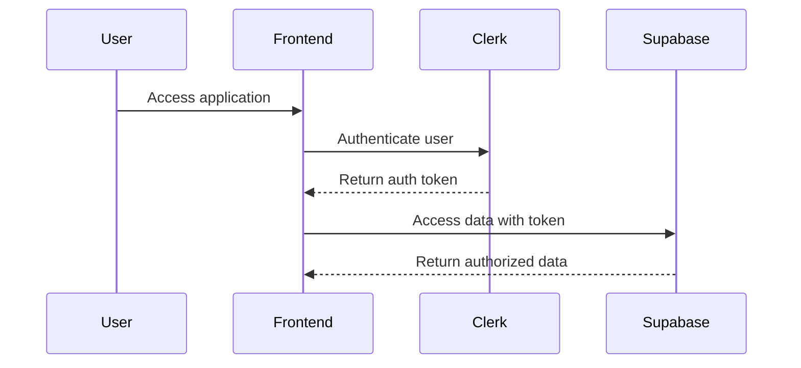
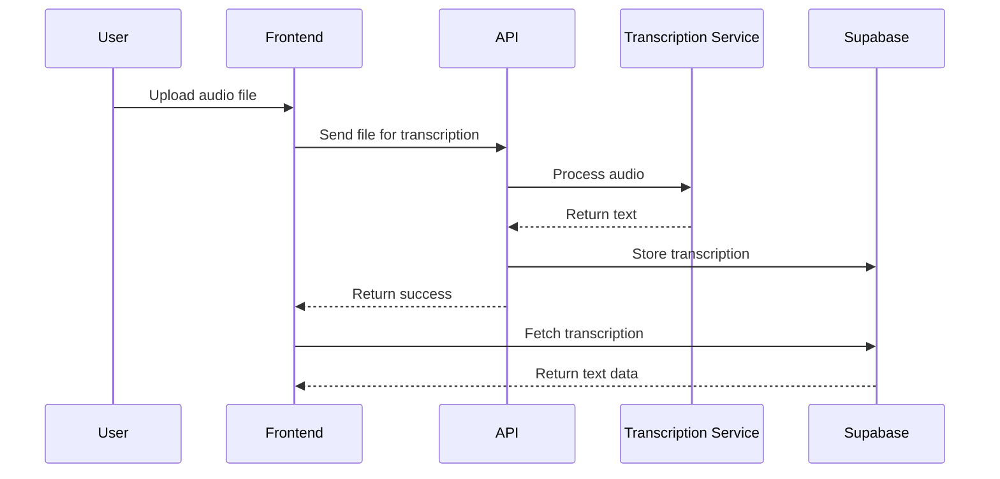
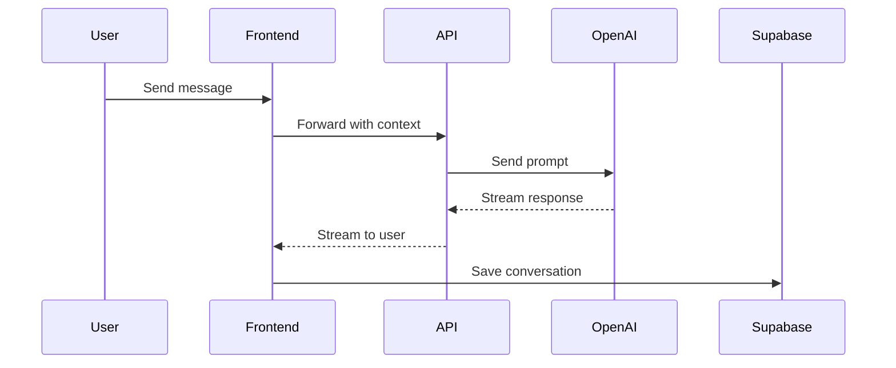

# System Patterns

## Architecture Overview

Reflectly follows a modern web application architecture with the following key components:

1. **Frontend**
   - Next.js 15 framework for server and client components
   - React for component-based UI development
   - Tailwind CSS for styling
   - Clerk for authentication

2. **Backend**
   - Supabase for database and authentication
   - PostgreSQL for relational data storage
   - Row Level Security (RLS) for data protection
   - Supabase Edge Functions for serverless processing

3. **AI Integration**
   - OpenAI API for natural language processing
   - Custom prompts and context management
   - Streaming responses for chat functionality

4. **Media Processing**
   - Audio transcription services
   - File storage in Supabase

## Design Patterns

### Frontend Patterns

1. **Server and Client Components**
   - Server components for data fetching and processing
   - Client components for interactive elements
   - Clear separation of concerns

2. **Data Fetching**
   - Server-side data fetching for initial load
   - Client-side fetching for dynamic updates
   - Optimistic UI updates for better user experience

3. **State Management**
   - Local component state for UI-specific state
   - Context API for shared state
   - Server state managed through data fetching

4. **Component Composition**
   - Atomic design principles
   - Reusable UI components
   - Composition over inheritance

### Backend Patterns

1. **Database Schema Design**
   - Normalized data structure
   - Foreign key relationships
   - Proper indexing for performance

2. **Security Model**
   - Row Level Security policies
   - Function-based access control
   - JWT-based authentication

3. **API Layer**
   - RESTful API endpoints
   - Serverless functions for specific operations
   - Proper error handling and validation

### AI Interaction Patterns

1. **Context Management**
   - Maintaining conversation history
   - Providing relevant context to AI
   - Managing token limits

2. **Prompt Engineering**
   - Structured prompt templates
   - Clear instructions for AI responses
   - Fallback mechanisms

3. **Response Processing**
   - Streaming responses for real-time feedback
   - Parsing and formatting AI outputs
   - Error handling for AI limitations

## Component Relationships

### User Authentication Flow



### Transcription Process



### Chat Interaction



## Data Flow

1. **Authentication**
   - User credentials → Clerk → JWT → Supabase → RLS filtered data

2. **Content Creation**
   - User input → Frontend validation → API processing → Database storage

3. **Content Retrieval**
   - User request → Server component → Database query → RLS filter → Rendered content

4. **AI Interaction**
   - User query → Context collection → OpenAI API → Response processing → UI presentation 

## React Performance Patterns

### Memoization Pattern

```typescript
// Component memoization with custom equality function
const TaskCard = memo(({ task, provided, snapshot /* ...props */ }) => {
  // Component implementation
  return (
    <div>
      {/* Component JSX */}
    </div>
  );
}, (prevProps, nextProps) => {
  // Only re-render if important props change
  return (
    prevProps.task.id === nextProps.task.id &&
    prevProps.task.content === nextProps.task.content &&
    prevProps.searchTerm === nextProps.searchTerm
    // Other important prop comparisons
  );
});
```

Key benefits:
- Prevents unnecessary re-renders
- Improves UI responsiveness
- Reduces wasted calculations

### Computation Caching Pattern

```typescript
// Cache expensive calculations with useMemo
const filteredData = useMemo(() => {
  // Expensive filtering operations
  return computeFilteredResults(data, filters);
}, [data, filters]);

// Memoize callback functions
const handleSave = useCallback((item) => {
  // Save implementation
}, [dependencies]);
```

Key benefits:
- Avoids redundant calculations
- Maintains function reference stability
- Prevents child component re-renders

### Debounced Storage Pattern

```typescript
// Debounce localStorage operations
useEffect(() => {
  let saveTimeout: NodeJS.Timeout;
  
  const saveData = () => {
    localStorage.setItem('key', JSON.stringify(data));
  };
  
  if (saveTimeout) clearTimeout(saveTimeout);
  saveTimeout = setTimeout(saveData, 500);
  
  return () => {
    clearTimeout(saveTimeout);
    saveData(); // Save on unmount
  };
}, [data]);
```

Key benefits:
- Reduces expensive I/O operations
- Prevents performance bottlenecks
- Ensures data is still saved

### Chunk Error Recovery Pattern

```typescript
const ChunkErrorHandler = () => {
  useEffect(() => {
    const handleChunkError = (event: ErrorEvent) => {
      const isChunkError = event.error?.message?.includes('ChunkLoadError');
      
      if (isChunkError) {
        // Handle the error, e.g., refresh the page
        setTimeout(() => window.location.reload(), 1000);
      }
    };
    
    window.addEventListener('error', handleChunkError);
    return () => window.removeEventListener('error', handleChunkError);
  }, []);
  
  return null;
};
```

Key benefits:
- Recovers from Next.js chunk loading failures
- Provides seamless user experience
- Prevents app crashes

## Authentication Patterns

### Auth Provider Pattern

```tsx
// auth-provider.tsx
import { createContext, useContext, useState, useEffect } from 'react';
import { supabase } from '../utils/supabase';

const AuthContext = createContext<{
  user: any | null;
  signIn: (email: string, password: string) => Promise<void>;
  signOut: () => Promise<void>;
  loading: boolean;
}>({
  user: null,
  signIn: async () => {},
  signOut: async () => {},
  loading: true
});

export const AuthProvider = ({ children }) => {
  const [user, setUser] = useState(null);
  const [loading, setLoading] = useState(true);

  useEffect(() => {
    // Check active session
    const getUser = async () => {
      const { data, error } = await supabase.auth.getSession();
      setUser(data?.session?.user || null);
      setLoading(false);
    };
    
    getUser();
    
    // Listen for auth changes
    const { data } = supabase.auth.onAuthStateChange((event, session) => {
      setUser(session?.user || null);
      setLoading(false);
    });
    
    return () => {
      data.subscription.unsubscribe();
    };
  }, []);

  return (
    <AuthContext.Provider value={{ 
      user, 
      signIn: async (email, password) => {
        await supabase.auth.signInWithPassword({ email, password });
      },
      signOut: async () => {
        await supabase.auth.signOut();
      },
      loading 
    }}>
      {children}
    </AuthContext.Provider>
  );
};

export const useAuth = () => useContext(AuthContext);
```

## Data Fetching Patterns

### Secure API Route Pattern

```typescript
// app/api/protected-data/route.ts
import { NextResponse } from 'next/server';
import { cookies } from 'next/headers';
import { createRouteHandlerClient } from '@supabase/auth-helpers-nextjs';

export async function GET(request: Request) {
  const supabase = createRouteHandlerClient({ cookies });
  
  // Verify authenticated user
  const { data: { session } } = await supabase.auth.getSession();
  if (!session) {
    return NextResponse.json({ error: 'Unauthorized' }, { status: 401 });
  }
  
  // Get data with RLS applied
  const { data, error } = await supabase
    .from('protected_table')
    .select('*');
    
  if (error) {
    return NextResponse.json({ error: error.message }, { status: 500 });
  }
  
  return NextResponse.json({ data });
}
```

## Form Handling Patterns

### Controlled Form Pattern

```tsx
import { useState } from 'react';

const FormComponent = () => {
  const [form, setForm] = useState({
    name: '',
    email: '',
    message: ''
  });
  
  const handleChange = (e: React.ChangeEvent<HTMLInputElement | HTMLTextAreaElement>) => {
    const { name, value } = e.target;
    setForm(prev => ({
      ...prev,
      [name]: value
    }));
  };
  
  const handleSubmit = async (e: React.FormEvent) => {
    e.preventDefault();
    // Submit form data
  };
  
  return (
    <form onSubmit={handleSubmit}>
      <input 
        type="text"
        name="name"
        value={form.name}
        onChange={handleChange}
      />
      {/* Other form elements */}
      <button type="submit">Submit</button>
    </form>
  );
};
```

## Error Handling Patterns

### API Error Handler Pattern

```typescript
// utils/api-error.ts
export class ApiError extends Error {
  public statusCode: number;
  public details?: any;
  
  constructor(message: string, statusCode: number, details?: any) {
    super(message);
    this.statusCode = statusCode;
    this.details = details;
    this.name = 'ApiError';
  }
  
  static fromResponse(response: Response): Promise<ApiError> {
    return response.json().then(body => {
      return new ApiError(
        body.message || 'An error occurred',
        response.status,
        body.details
      );
    });
  }
}

// Using the error handler
const fetchData = async () => {
  try {
    const response = await fetch('/api/data');
    
    if (!response.ok) {
      throw await ApiError.fromResponse(response);
    }
    
    return await response.json();
  } catch (error) {
    if (error instanceof ApiError) {
      // Handle API error
      console.error(`API Error (${error.statusCode}): ${error.message}`);
    } else {
      // Handle other errors
      console.error('Unexpected error:', error);
    }
  }
};
``` 