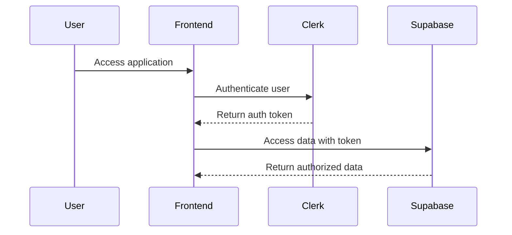
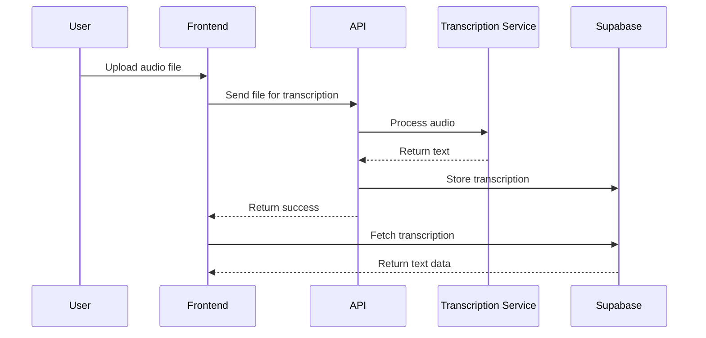
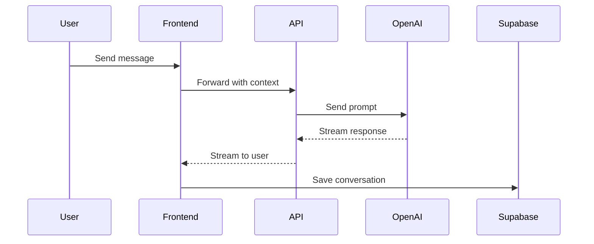

# System Patterns

## Architecture Overview

Reflectly follows a modern web application architecture with the following key components:

1. **Frontend**
   - Next.js 15 framework for server and client components
   - React for component-based UI development
   - Tailwind CSS for styling
   - Clerk for authentication

2. **Backend**
   - Supabase for database and authentication
   - PostgreSQL for relational data storage
   - Row Level Security (RLS) for data protection
   - Supabase Edge Functions for serverless processing

3. **AI Integration**
   - OpenAI API for natural language processing
   - Custom prompts and context management
   - Streaming responses for chat functionality

4. **Media Processing**
   - Audio transcription services
   - File storage in Supabase

## Design Patterns

### Frontend Patterns

1. **Server and Client Components**
   - Server components for data fetching and processing
   - Client components for interactive elements
   - Clear separation of concerns

2. **Data Fetching**
   - Server-side data fetching for initial load
   - Client-side fetching for dynamic updates
   - Optimistic UI updates for better user experience

3. **State Management**
   - Local component state for UI-specific state
   - Context API for shared state
   - Server state managed through data fetching

4. **Component Composition**
   - Atomic design principles
   - Reusable UI components
   - Composition over inheritance

### Backend Patterns

1. **Database Schema Design**
   - Normalized data structure
   - Foreign key relationships
   - Proper indexing for performance

2. **Security Model**
   - Row Level Security policies
   - Function-based access control
   - JWT-based authentication

3. **API Layer**
   - RESTful API endpoints
   - Serverless functions for specific operations
   - Proper error handling and validation

### AI Interaction Patterns

1. **Context Management**
   - Maintaining conversation history
   - Providing relevant context to AI
   - Managing token limits

2. **Prompt Engineering**
   - Structured prompt templates
   - Clear instructions for AI responses
   - Fallback mechanisms

3. **Response Processing**
   - Streaming responses for real-time feedback
   - Parsing and formatting AI outputs
   - Error handling for AI limitations

## Component Relationships

### User Authentication Flow

### Transcription Process

### Chat Interaction

## Data Flow

1. **Authentication**
   - User credentials → Clerk → JWT → Supabase → RLS filtered data

2. **Content Creation**
   - User input → Frontend validation → API processing → Database storage

3. **Content Retrieval**
   - User request → Server component → Database query → RLS filter → Rendered content

4. **AI Interaction**
   - User query → Context collection → OpenAI API → Response processing → UI presentation 