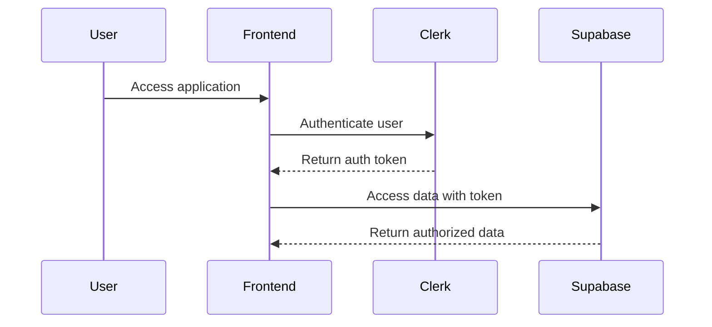
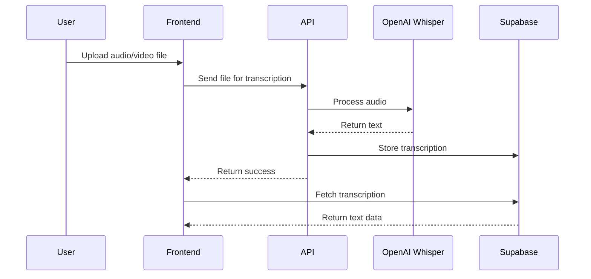
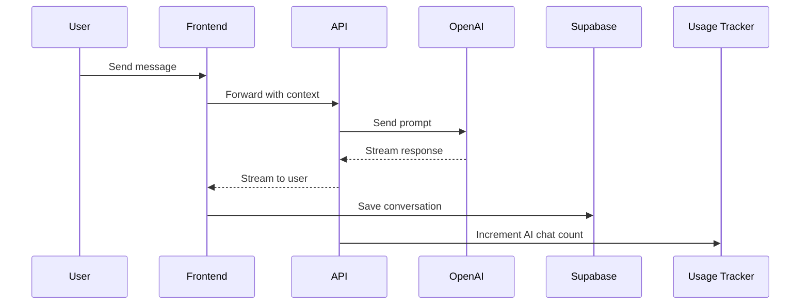
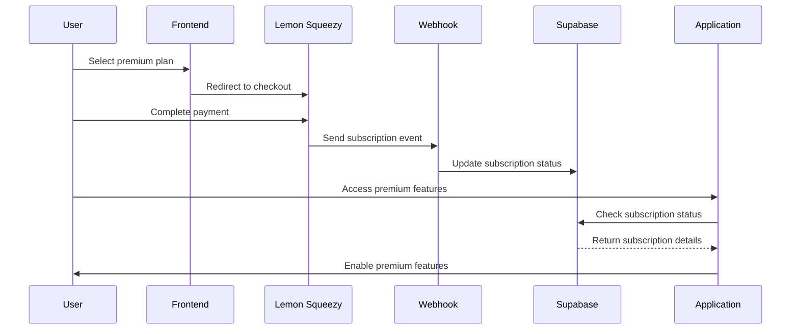

# System Patterns

## Architecture Overview

Reflectly follows a modern web application architecture with the following key components:

1. **Frontend**
   - Next.js 14/15 framework with App Router for server and client components
   - React 18 for component-based UI development
   - Tailwind CSS for styling with shadcn/ui components
   - Clerk for authentication UI
   - Dark/light mode support via next-themes

2. **Backend**
   - Supabase for database and authentication
   - PostgreSQL for relational data storage
   - Row Level Security (RLS) for data protection
   - Supabase Edge Functions for serverless processing
   - Next.js API routes for application logic

3. **AI Integration**
   - OpenAI API for natural language processing
   - OpenAI Whisper API for audio transcription
   - Custom prompts and context management
   - Streaming responses for chat functionality

4. **Media Processing**
   - FFmpeg WebAssembly for client-side video processing
   - Audio transcription with OpenAI Whisper
   - File storage in Supabase
   - Video player with transcript synchronization

5. **Subscription Management**
   - Lemon Squeezy for payment processing
   - Webhook handling for subscription events
   - Usage tracking and limits enforcement
   - Tiered plans with differentiated features

## Design Patterns

### Frontend Patterns

1. **Server and Client Components**
   - Server components for data fetching and processing
   - Client components for interactive elements
   - Clear separation of concerns with appropriate use of "use client" directives
   - Middleware for authentication and route protection

2. **Data Fetching**
   - Server-side data fetching for initial load
   - Client-side fetching for dynamic updates
   - Optimistic UI updates for better user experience
   - Error handling and loading states

3. **State Management**
   - Zustand for complex global state
   - React Context API for theme and authentication
   - Local component state with useState for UI-specific state
   - Server state managed through data fetching
   - Local storage for persisting user preferences

4. **Component Composition**
   - Atomic design principles
   - Reusable UI components with shadcn/ui
   - Composition over inheritance
   - Proper prop typing with TypeScript

### Backend Patterns

1. **Database Schema Design**
   - Normalized data structure with proper relationships
   - Foreign key constraints for data integrity
   - Consistent naming conventions
   - Proper indexing for performance optimization
   - Timestamping for all records (created_at, updated_at)

2. **Security Model**
   - Row Level Security policies for all tables
   - Function-based access control
   - JWT-based authentication
   - Secure API routes with proper authentication checks
   - Protection of sensitive operations

3. **API Layer**
   - RESTful API endpoints
   - Next.js API routes with proper error handling
   - Consistent response formats
   - Validation of inputs
   - Rate limiting for sensitive operations

4. **Database Migrations**
   - Timestamped SQL migration files
   - Clear naming conventions
   - Proper organization by feature
   - Transaction-based updates
   - Rollback capabilities

### AI Interaction Patterns

1. **Context Management**
   - Maintaining conversation history in database
   - Providing relevant context to AI via prompts
   - Managing token limits with chunking
   - Storing conversation metadata for continuity

2. **Prompt Engineering**
   - Structured prompt templates
   - Clear instructions for AI responses
   - Role-based prompting (system, user, assistant)
   - Fallback mechanisms for rate limits or errors

3. **Response Processing**
   - Streaming responses for real-time feedback
   - Parsing and formatting AI outputs
   - Error handling for API limitations
   - Graceful degradation when AI services are unavailable

4. **Usage Management**
   - Tracking API calls per user
   - Enforcing usage limits based on subscription
   - Providing feedback on remaining quota
   - Optimizing token usage to reduce costs

## Component Relationships

### User Authentication Flow



### Transcription Process



### Chat Interaction



### Subscription Management



## Data Flow

1. **Authentication**
   - User credentials → Clerk → JWT → Supabase → RLS filtered data

2. **Content Creation**
   - User input → Frontend validation → API processing → Database storage

3. **Content Retrieval**
   - User request → Server component → Database query → RLS filter → Rendered content

4. **AI Interaction**
   - User query → Context collection → OpenAI API → Response processing → UI presentation 
   - Usage tracking → Limit enforcement → Subscription status check

5. **Subscription Flow**
   - Plan selection → Checkout → Webhook event → Database update → Feature access

## React Performance Patterns

### Memoization Pattern

```typescript
// Component memoization with custom equality function
const TaskCard = memo(({ task, provided, snapshot /* ...props */ }) => {
  // Component implementation
  return (
    <div>
      {/* Component JSX */}
    </div>
  );
}, (prevProps, nextProps) => {
  // Only re-render if important props change
  return (
    prevProps.task.id === nextProps.task.id &&
    prevProps.task.content === nextProps.task.content &&
    prevProps.searchTerm === nextProps.searchTerm
    // Other important prop comparisons
  );
});
```

Key benefits:
- Prevents unnecessary re-renders
- Improves UI responsiveness
- Reduces wasted calculations

### Computation Caching Pattern

```typescript
// Cache expensive calculations with useMemo
const filteredData = useMemo(() => {
  // Expensive filtering operations
  return computeFilteredResults(data, filters);
}, [data, filters]);

// Memoize callback functions
const handleSave = useCallback((item) => {
  // Save implementation
}, [dependencies]);
```

Key benefits:
- Avoids redundant calculations
- Maintains function reference stability
- Prevents child component re-renders

### Debounced Storage Pattern

```typescript
// Debounce localStorage operations
useEffect(() => {
  let saveTimeout: NodeJS.Timeout;
  
  const saveData = () => {
    localStorage.setItem('key', JSON.stringify(data));
  };
  
  if (saveTimeout) clearTimeout(saveTimeout);
  saveTimeout = setTimeout(saveData, 500);
  
  return () => {
    clearTimeout(saveTimeout);
    saveData(); // Save on unmount
  };
}, [data]);
```

Key benefits:
- Reduces expensive I/O operations
- Prevents performance bottlenecks
- Ensures data is still saved

### Chunk Error Recovery Pattern

```typescript
const ChunkErrorHandler = () => {
  useEffect(() => {
    const handleChunkError = (event: ErrorEvent) => {
      const isChunkError = event.error?.message?.includes('ChunkLoadError');
      
      if (isChunkError) {
        // Handle the error, e.g., refresh the page
        setTimeout(() => window.location.reload(), 1000);
      }
    };
    
    window.addEventListener('error', handleChunkError);
    return () => window.removeEventListener('error', handleChunkError);
  }, []);
  
  return null;
};
```

Key benefits:
- Recovers from Next.js chunk loading failures
- Provides seamless user experience
- Prevents app crashes

## Authentication Patterns

### Auth Provider Pattern

```tsx
// auth-provider.tsx
import { createContext, useContext, useState, useEffect } from 'react';
import { supabase } from '../utils/supabase';

const AuthContext = createContext<{
  user: any | null;
  signIn: (email: string, password: string) => Promise<void>;
  signOut: () => Promise<void>;
  loading: boolean;
}>({
  user: null,
  signIn: async () => {},
  signOut: async () => {},
  loading: true
});

export const AuthProvider = ({ children }) => {
  const [user, setUser] = useState(null);
  const [loading, setLoading] = useState(true);

  useEffect(() => {
    // Check active session
    const getUser = async () => {
      const { data, error } = await supabase.auth.getSession();
      setUser(data?.session?.user || null);
      setLoading(false);
    };
    
    getUser();
    
    // Listen for auth changes
    const { data } = supabase.auth.onAuthStateChange((event, session) => {
      setUser(session?.user || null);
      setLoading(false);
    });
    
    return () => {
      data.subscription.unsubscribe();
    };
  }, []);

  return (
    <AuthContext.Provider value={{ 
      user, 
      signIn: async (email, password) => {
        await supabase.auth.signInWithPassword({ email, password });
      },
      signOut: async () => {
        await supabase.auth.signOut();
      },
      loading 
    }}>
      {children}
    </AuthContext.Provider>
  );
};

export const useAuth = () => useContext(AuthContext);
```

## Subscription Management Patterns

### Usage Tracking Pattern

```typescript
// Increment usage count and check limits
export async function incrementTranscriptionCount(userId: string): Promise<boolean> {
  const supabase = createClient();
  
  const { data, error } = await supabase
    .rpc('increment_transcription_count', { user_id: userId });
  
  return !!data && !error;
}

// Database function implementation
CREATE OR REPLACE FUNCTION increment_transcription_count(user_id UUID)
RETURNS BOOLEAN AS $$
DECLARE
  current_count INTEGER;
  max_limit INTEGER;
  plan_type TEXT;
BEGIN
  -- Get user's subscription plan
  SELECT us.plan_type INTO plan_type
  FROM user_subscriptions us
  WHERE us.user_id = $1
  AND us.status = 'active';
  
  -- Set limit based on plan
  IF plan_type = 'premium' THEN
    max_limit := 50;
  ELSE
    max_limit := 5; -- Free plan
  END IF;
  
  -- Get current usage
  SELECT transcription_count INTO current_count
  FROM user_usage
  WHERE user_id = $1;
  
  -- Check if limit reached
  IF current_count >= max_limit THEN
    RETURN FALSE;
  END IF;
  
  -- Increment count
  UPDATE user_usage
  SET transcription_count = transcription_count + 1
  WHERE user_id = $1;
  
  RETURN TRUE;
END;
$$ LANGUAGE plpgsql SECURITY DEFINER;
```

### Subscription Status Check Pattern

```typescript
// Get user's subscription status with usage statistics
export async function getUserSubscriptionStatus(userId: string): Promise<SubscriptionStatus> {
  // Initialize Supabase client
  const supabase = createClient();
  
  // Get the user's subscription
  const { data: subscription } = await supabase
    .from('user_subscriptions')
    .select('*')
    .eq('user_id', userId)
    .single();
  
  // Get the user's usage
  const { data: usage } = await supabase
    .from('user_usage')
    .select('*')
    .eq('user_id', userId)
    .single();
  
  // Refresh from payment provider if needed
  if (subscription?.subscription_id) {
    const lastUpdate = new Date(subscription.updated_at);
    const oneDayAgo = new Date();
    oneDayAgo.setDate(oneDayAgo.getDate() - 1);
    
    if (lastUpdate < oneDayAgo) {
      await refreshSubscriptionFromProvider(userId);
      // Refetch updated data if needed
    }
  }
  
  // Calculate status and limits
  const isPremium = subscription?.plan_type === 'premium' && 
                   subscription?.status === 'active';
  const plan = subscription?.plan_type || 'free';
  
  // Return comprehensive status object
  return {
    isPremium,
    plan,
    status: subscription?.status || 'inactive',
    usageStats: {
      // Feature usage statistics
    }
  };
}
```

## Form Handling Patterns

### Controlled Form Pattern

```tsx
import { useState } from 'react';

const FormComponent = () => {
  const [form, setForm] = useState({
    name: '',
    email: '',
    message: ''
  });
  
  const handleChange = (e: React.ChangeEvent<HTMLInputElement | HTMLTextAreaElement>) => {
    const { name, value } = e.target;
    setForm(prev => ({
      ...prev,
      [name]: value
    }));
  };
  
  const handleSubmit = async (e: React.FormEvent) => {
    e.preventDefault();
    // Submit form data
  };
  
  return (
    <form onSubmit={handleSubmit}>
      <input 
        type="text"
        name="name"
        value={form.name}
        onChange={handleChange}
      />
      {/* Other form elements */}
      <button type="submit">Submit</button>
    </form>
  );
};
```

## Error Handling Patterns

### API Error Handler Pattern

```typescript
// utils/api-error.ts
export class ApiError extends Error {
  public statusCode: number;
  public details?: any;
  
  constructor(message: string, statusCode: number, details?: any) {
    super(message);
    this.statusCode = statusCode;
    this.details = details;
    this.name = 'ApiError';
  }
  
  static fromResponse(response: Response): Promise<ApiError> {
    return response.json().then(body => {
      return new ApiError(
        body.message || 'An error occurred',
        response.status,
        body.details
      );
    });
  }
}

// Using the error handler
const fetchData = async () => {
  try {
    const response = await fetch('/api/data');
    
    if (!response.ok) {
      throw await ApiError.fromResponse(response);
    }
    
    return await response.json();
  } catch (error) {
    if (error instanceof ApiError) {
      // Handle API error
      console.error(`API Error (${error.statusCode}): ${error.message}`);
    } else {
      // Handle other errors
      console.error('Unexpected error:', error);
    }
  }
};
```

## Media Processing Patterns

### Transcription Processing Pattern

```typescript
// Transcribe audio/video file
export async function POST(request: Request) {
  try {
    // Extract file from form data
    const formData = await request.formData();
    const file = formData.get('file');
    const projectId = formData.get('projectId');
    
    // Validate inputs
    if (!file || !(file instanceof File)) {
      return NextResponse.json(
        { error: 'No file uploaded or invalid file' },
        { status: 400 }
      );
    }
    
    // Initialize OpenAI client
    const openai = new OpenAI({
      apiKey: process.env.OPENAI_API_KEY,
    });
    
    // Process file to appropriate format
    const fileBuffer = Buffer.from(await file.arrayBuffer());
    
    // Send to Whisper API
    const transcriptionResponse = await openai.audio.transcriptions.create({
      file: new File([fileBuffer], file.name, { type: file.type }),
      model: "whisper-1",
      response_format: "verbose_json",
      timestamp_granularities: ["segment"],
    });
    
    // Transform response to application format
    const transformedTranscripts = transcriptionResponse.segments?.map(segment => ({
      start: segment.start,
      end: segment.end,
      text: segment.text,
      speaker: `Speaker ${(index % 2) + 1}`
    })) || [];
    
    // Store in database if project ID provided
    let storedTranscriptId;
    if (projectId) {
      // Verify project exists and user has access
      // Store transcript in database
      // Track usage for subscription limits
    }
    
    // Return processed transcript data
    return NextResponse.json({ 
      transcripts: transformedTranscripts,
      id: storedTranscriptId,
      message: 'Transcript generated successfully'
    });
  } catch (error) {
    // Handle and log error
    return NextResponse.json(
      { error: `Failed to generate transcript: ${error.message}` },
      { status: 500 }
    );
  }
}
```

## UI Component Patterns

### Synced Media Player Pattern

```tsx
// Synchronized transcript and video player
const TranscriptPlayer = ({ videoUrl, transcript }) => {
  const [currentTime, setCurrentTime] = useState(0);
  const [activeSegment, setActiveSegment] = useState(null);
  const videoRef = useRef(null);
  
  // Update active segment based on current time
  useEffect(() => {
    const segment = transcript.find(
      seg => currentTime >= seg.start && currentTime <= seg.end
    );
    setActiveSegment(segment?.id || null);
  }, [currentTime, transcript]);
  
  // Handle time update from video player
  const handleTimeUpdate = () => {
    if (videoRef.current) {
      setCurrentTime(videoRef.current.currentTime);
    }
  };
  
  // Scroll to segment when clicked
  const scrollToSegment = (segmentId, startTime) => {
    if (videoRef.current) {
      videoRef.current.currentTime = startTime;
      videoRef.current.play();
    }
  };
  
  return (
    <div className="transcript-player">
      <video 
        ref={videoRef}
        src={videoUrl}
        onTimeUpdate={handleTimeUpdate}
        controls
      />
      <div className="transcript-segments">
        {transcript.map(segment => (
          <div 
            key={segment.id}
            className={`segment ${activeSegment === segment.id ? 'active' : ''}`}
            onClick={() => scrollToSegment(segment.id, segment.start)}
          >
            {segment.text}
          </div>
        ))}
      </div>
    </div>
  );
};
``` 